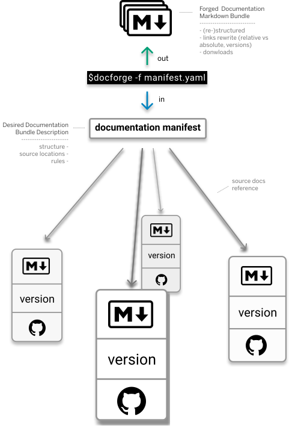
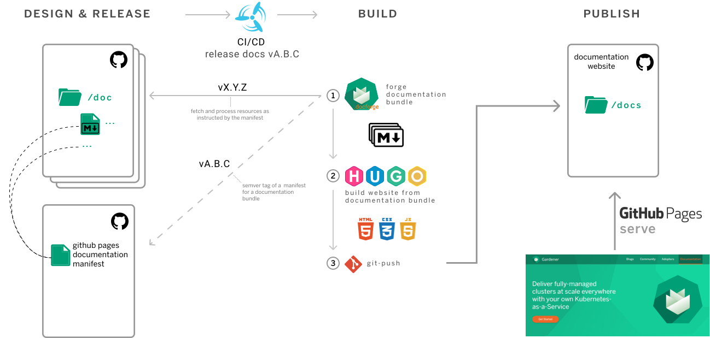

# docforge
[](https://api.reuse.software/info/github.com/gardener/docforge)


Docforge is a *Documentation-As-Code* enabling command-line tool that reproducibly *forges* source documentation into publishable documentation bundles, using desired documentation state declarations called *documentation manifests*. A documentation manifest includes structured references to source documentation files and rules for fetching sources. All links within the Markdown documents are adjusted automatically according to declared structure. Embeddable resources, like images, are download and packed into the bundles.

Docforge currently supports GitHub and GitHub Enterprise as remote source hosts (github.com and self-hosted GitHub Enterprise instances). It was designed to solve the outstanding issue for multi-repo projects that want to maintain documentation in a distributed manner and yet release aggregated, coherent bundles out of it with minimal effort.

Docforge is designed to support the re-purposing of documentation sources. Instead of designing documentation structures for a particular tool or platform, a single one is sufficient to produce multiple documentation bundles from it, each described in its own manifest, and targeting a particular publishing channel or purpose. The tool goes even further supporting the creation of completely new documents from existing sources by aggregations.

Docforge manifests are modular, supporting references to other manifests that are included recursively for maintaining potentially complex structures, e.g. for large documentation portals.


<figcaption>Figure 1: Docforge overview</figcaption>

From Documentation-as-Code tool chain perspective, Docforge is the tool that makes source documentation available for further transformation, processing and publishing. 

Figure 2 shows one of many options to build a Documentation-as-Code automated process, orchestrated by CI/CD, focusing on the role of Docforge. In this particular example, source documentation resides in multiple repositories and needs to be built as a static HTML website with a static site generator, and then pushed to a repository configured to be served by GitHub Pages. When a new release is triggered, Docforge will use the released version of the documentation manifest dedicated to publishing with GitHub Pages to forge a bundle for this release. The bundle will then be used as input content by the next tool in the build process — the static site generator.



<figcaption>Figure 2: Sample documentation-as-code tool chain, including Docforge as step 1 in the documentation build process</figcaption>

At a glance:
- Declarative
- Document selection rules support
- Composable manifests that can include references to other manifests recursively
- Designed to forge from distributed, remote documentation sources
- Abstracts source documentation to re-purpose it into documentation bundles targeting various platforms and tools
- Efficient operation
- out-of-the-box, optional support for Hugo and other static site generators
- out-of-the-box, support for GitHub and GitHub Enterprise

## Installation

### Users

Go to the [latest release](https://github.com/gardener/docforge/releases/latest) and download the binary for your OS and architecture:

| OS | Architecture | Binary name |
|----|---|---|
| macOS | Intel (x86_64) | `docforge-darwin-amd64` |
| macOS | Apple Silicon (arm64) | `docforge-darwin-arm64` |
| Linux | x86_64 | `docforge-linux-amd64` |
| Linux | arm64 | `docforge-linux-arm64` |
| Windows | x86 | `docforge-windows-386` |

Download the archive, extract the binary, and place it on your PATH. Example for Linux/macOS:

```sh
# Replace <BINARY> with the binary name for your platform from the table above
curl -Lo /tmp/docforge.tar.gz \
  https://github.com/gardener/docforge/releases/latest/download/<BINARY>
tar -xzf /tmp/docforge.tar.gz -C /tmp
chmod +x /tmp/<BINARY>
sudo mv /tmp/<BINARY> /usr/local/bin/docforge
```

> **Disclaimer on releases**: Until there is a stable 1.0 version changes are likely to occur and not necessarily backwards compatible. New features are released with a minor version increase. We do not release hotfixes except for the latest minor release, only for bugs and only when critical.

### Operators

Docker images with all docforge releases are public at [Google Artifact Registry](https://console.cloud.google.com/artifacts/docker/gardener-project/europe/releases/docforge?project=gardener-project&gcrImageListsize=30). To pull a docforge image for a release use the release as image tag, e.g. for docforge version [`v0.58.0`](https://github.com/gardener/docforge/releases/tag/v0.58.0):
```sh
docker pull europe-docker.pkg.dev/gardener-project/releases/docforge:v0.58.0
```

### Developers

```sh
go install github.com/gardener/docforge@latest
```

## Usage

> **GitHub API rate limits**: docforge uses the GitHub API to fetch content. Unauthenticated requests are limited to 60 per hour per IP. It is strongly recommended to supply a [personal access token](https://github.com/settings/tokens) via `--github-oauth-env-map`.

## Quick Start (5 minutes)

Get from zero to a real output bundle. Every command is copy-pasteable — the only edit you need is pasting your token in step 1.

**1. Create a GitHub token and export it**

Go to **github.com → Settings → Developer settings → Personal access tokens → Tokens (classic)**, create a token with **`repo` (read)** scope, then:

```sh
export GITHUB_TOKEN=ghp_yourTokenHere
```

**2. Dry run — inspect the resolved node tree**

```sh
docforge \
  -f https://github.com/gardener/docforge/blob/master/example/getting-started.yaml \
  -d /tmp/docforge-dry \
  --github-oauth-env-map github.com=GITHUB_TOKEN \
  --dry-run
```

This prints the resolved manifest node tree to stdout. **`--dry-run` does not prevent files from being written** — downloads still run and files land in `/tmp/docforge-dry`. Use a separate throwaway directory (as above) so the real run in step 3 starts clean.
<!-- verified: cmd/app/exec.go DryRun branch — only effect is fmt.Println(documentNodes[0]); core.Run executes unconditionally -->

**3. Real run — write the bundle**

```sh
docforge \
  -f https://github.com/gardener/docforge/blob/master/example/getting-started.yaml \
  -d /tmp/docforge-out \
  --github-oauth-env-map github.com=GITHUB_TOKEN
```

**You should now see** (the tree reflects `master` at run time):

```
/tmp/docforge-out/
├── README.md
└── docs/
    ├── cmd-ref/
    │   └── docforge_gen-toc.md
    ├── consistency.md
    ├── how-to.md
    ├── images/
    │   ├── docforge-overview.svg
    │   └── ...
    ├── manifest-ref.md
    ├── manifests.md
    └── user-index.md
```

With `markdown-enabled: true` in `~/.docforge/config`, `README.md` would instead be written as `_index.md`.

<!-- verified: pkg/nodeplugins/downloader/resourcedownloader.go Write call passes nil IndexFileNames — no rename without markdown plugin; pkg/nodeplugins/markdown/document/document_worker.go Write call passes d.hugo.IndexFileNames -->
<!-- verified: example/getting-started.yaml excludeFiles — docforge.md, docforge_completion.md, docforge_gen-cmd-docs.md, docforge_version.md excluded; docforge_gen-toc.md included -->

What just happened? See [Working with Documentation Manifests](docs/manifests.md) and [How-to guides](docs/how-to.md) for a deeper walkthrough.

---

## Common errors

| If you see… | It means / fix |
|---|---|
| `github.com's OAUTH ENV variable is empty` | The env var named in `--github-oauth-env-map` is set but empty. Make sure `export GITHUB_TOKEN=...` was run in the **same shell session** before invoking docforge. <!-- verified: cmd/app/initilization.go oAuthToken == "" → fmt.Errorf("%s's OAUTH ENV variable is empty", host) --> |
| `no resource handlers were loaded. Is the config yaml file correct?` | `--github-oauth-env-map` was not provided or every entry failed (e.g. all tokens empty). Add `--github-oauth-env-map github.com=YOUR_ENV_VAR` and make sure the env var is exported. <!-- verified: cmd/app/initilization.go len(rhs) == 0 → fmt.Errorf("no resource handlers were loaded...") --> |
| Passing a local path to `-f` (e.g. `-f ./manifest.yaml`) produces a "no resource handlers" error or resolves nothing | Manifests are resolved through the repository-host abstraction — local filesystem paths are not supported directly. Use a GitHub `blob` URL (e.g. `https://github.com/org/repo/blob/main/manifest.yaml`) or add a `resourceMappings` entry in `~/.docforge/config` to map a GitHub URL prefix to a local directory. See [Manifest URLs must be accessible via a registered host](docs/how-to.md#manifest-urls-must-be-accessible-via-a-registered-host). <!-- verified: pkg/registry/repositoryhost/repository_host.go ResourceMappings mapstructure:"resourceMappings"; cmd/app/exec.go NewLocal registration --> |
| `.md` files in the output have unrewritten links, no frontmatter, or are not renamed to `_index.md` | `markdown-enabled` is `false` by default — `.md` files are copied as raw bytes with no processing at all. Add `markdown-enabled: true` to `~/.docforge/config`. This is a config-file-only setting; there is no CLI flag. See [Non-Hugo configuration](#non-hugo-configuration). <!-- verified: cmd/app/exec.go MarkdownEnabled guard — markdown plugin only registered when true; pkg/manifest/manifest.go setDefaultProcessor — assigns "downloader" to all file nodes otherwise --> |
| `--dry-run` was passed but files were still written to `--destination` | This is expected. `--dry-run` prints the node tree and suppresses `--clean-destination`; it does **not** skip downloads or writes. If you want no output, omit `--destination` — but note that omitting it causes writes to the current working directory (FSWriter uses it as the root). The safest option is a throwaway directory. <!-- verified: cmd/app/exec.go DryRun branch — fmt.Println(documentNodes[0]); core.Run executes unconditionally; pkg/writers/fswriter.go filepath.Join(f.Root, path) with Root="" writes to CWD --> |

---

### Commands

| Command | Description |
|---|---|
| `docforge` | Forge a documentation bundle from a manifest |
| `docforge gen-toc` | Generate a navigation YAML from a manifest |
| `docforge gen-cmd-docs` | Generate command reference documentation |
| `docforge version` | Print the version |

### Forge a build

To create a documentation bundle, describe its structure in a manifest file. See [Working with Documentation Manifests](docs/manifests.md) for the full manifest syntax, or the [manifest reference](docs/manifest-ref.md) for all supported fields.

A minimal example manifest is provided at [example/getting-started.yaml](example/getting-started.yaml).

#### GitHub token setup

Docforge uses the GitHub API to fetch content. Unauthenticated requests are limited to 60 per hour per IP. Set up a [personal access token](https://github.com/settings/tokens) and export it:

```sh
export GITHUB_TOKEN=<your-token>
```

#### Run

```sh
docforge \
  -d /tmp/docforge-out \
  -f example/getting-started.yaml \
  --github-oauth-env-map github.com=GITHUB_TOKEN
```

Use `--dry-run` to print the resolved manifest node tree to stdout without cleaning the destination. Note: `--dry-run` does **not** prevent files from being written — node processing and downloads still run. It only suppresses `--clean-destination` and prints the resolved node tree:

```sh
docforge \
  --dry-run \
  -f example/getting-started.yaml \
  --github-oauth-env-map github.com=GITHUB_TOKEN
```

All available flags are documented in the [command reference](docs/cmd-ref/docforge.md).

#### Notable flags and their defaults

The following flags have non-obvious defaults or behavior that is easy to miss:

| Flag | Default | What it actually does |
|---|---|---|
| `--hugo` | `true` | Enables Hugo-specific processing on every build. Pass `--hugo=false` for non-Hugo targets. |
| `--hugo-pretty-urls` | `true` | **Currently has no effect.** The field is registered but not consumed by the link resolver — pretty-URL rewriting is controlled solely by `--hugo`. |
| `--hugo-section-files` | `[readme.md, README.md]` | Files matching these names are renamed to `_index.md` in the output. |
| `--content-files-formats` | _(empty)_ | When empty, all file types pass through. When set (e.g. `.md`), only files with matching extensions are included. |
| `--clean-destination` | `false` | When set, removes the destination directory before writing. Ignored with `--dry-run`. |
| `--aliases-enabled` | `false` | Enables Hugo alias propagation from `dir` frontmatter to child files. |
| `--docsy-edit-this-page-enabled` | `false` | Adds Docsy "Edit this page" frontmatter fields to output files. |
| `--github-info-destination` | _(empty)_ | When set, writes a `.json` sidecar per source file containing GitHub commit metadata (author, contributors, last modified date, publish date, SHA). |
<!-- verified: cmd/app/flags.go — all defaults from pflag registration; cmd/hugo/option.go Hugo struct -->
<!-- verified: pkg/registry/repositoryhost/github_info.go GitInfo struct for json field names -->

### Generate a navigation TOC

`gen-toc` is a separate command with a distinct purpose: instead of fetching and writing document content, it reads a manifest and derives a navigation structure from it. The result is a YAML file that can be consumed by VitePress, MkDocs, or other site generators that accept a nav file — without running a full forge.

```sh
docforge gen-toc \
  -f example/getting-started.yaml \
  --github-oauth-env-map github.com=GITHUB_TOKEN
```

Write to a file instead of stdout:

```sh
docforge gen-toc \
  -f example/getting-started.yaml \
  --github-oauth-env-map github.com=GITHUB_TOKEN \
  -o toc.yaml
```

The output is a YAML file with a `nav` key containing nested entries. Each entry has a `title` (resolved from the manifest or document frontmatter) and a `filename` (the path within the output bundle). Sections with children include a `subnav` list:

```yaml
nav:
  - title: Installation Guide
    filename: Installation/README.md
    subnav:
      - title: Quick Start Guide
        filename: Installation/quickstart.md
      - title: Advanced
        filename: Installation/advanced.md
  - title: Operations
    filename: Operations/README.md
    subnav:
      - title: Gardener Operator
        filename: Operations/gardener-operator/README.md
        subnav:
          - title: Api Resources
            filename: Operations/gardener-operator/api-resources.md
  - title: Troubleshooting
    filename: Troubleshooting/README.md
```

Paths in `filename` are relative to the bundle root (the `--destination` directory of the corresponding forge run). Use `--strip-root` to remove the top-level directory prefix from all paths.

<!-- verified: pkg/gentoc/tests/toc.yaml — real gen-toc output format -->

Title resolution order (first match wins):
1. `frontmatter.title` in the manifest node
2. `title` in the document's own frontmatter (read from the source `.md` file)
3. Filename with hyphens/underscores replaced by spaces, Title case

<!-- verified: cmd/app/gentoc.go + pkg/gentoc/gentoc.go -->

| Flag | Default | Description |
|---|---|---|
| `-f, --manifest` | _(required)_ | Manifest URL or local path |
| `-o, --output` | stdout | Output file path |
| `--index-file-names` | `[readme.md, README.md, index.md]` | Filenames treated as section index (promoted to section entry) |
| `--strip-root` | `false` | Strip the top-level directory prefix from all output paths |
| `--github-oauth-env-map` | _(empty)_ | GitHub token map, same format as the forge command |

<!-- verified: go run ./cmd/... gen-toc --help -->

## Non-Hugo configuration

When targeting a non-Hugo site generator or a plain file output, use the following configuration (in `~/.docforge/config` or passed via `DOCFORGE_CONFIG`):

```yaml
hugo: false
hugo-section-files: []
markdown-enabled: true
```

- **`hugo: false`** — disables all Hugo-specific processing: files are written with their original names and links are not rewritten to pretty-URL format.
- **`hugo-section-files: []`** — prevents `readme.md` / `README.md` from being renamed to `_index.md`. This setting only takes effect when `hugo: true`; it is included here so that enabling Hugo later does not accidentally rename your index files.
- **`markdown-enabled: true`** — **required for Markdown processing to work at all.** When false (the default), `.md` files are copied as raw bytes with no link rewriting, no frontmatter propagation, and no Hugo transformations. This is a config-file-only setting; it has no corresponding CLI flag.

<!-- verified: cmd/markdown/option.go MarkdownEnabled mapstructure:"markdown-enabled" — no pflag registration in cmd/app/flags.go -->
<!-- verified: cmd/app/exec.go:72-75 — markdown plugin only registered when MarkdownEnabled=true; pkg/manifest/manifest.go:402-404 setDefaultProcessor assigns "downloader" to all file nodes otherwise -->

## What's next
- [User Documentation](docs/user-index.md)
- [Working with Documentation Manifests](docs/manifests.md)
- [Manifest Reference](docs/manifest-ref.md)
- [Command Reference](docs/cmd-ref/docforge.md)
