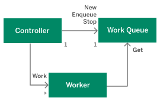
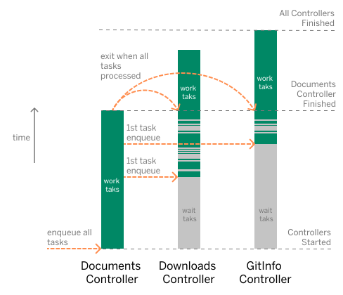
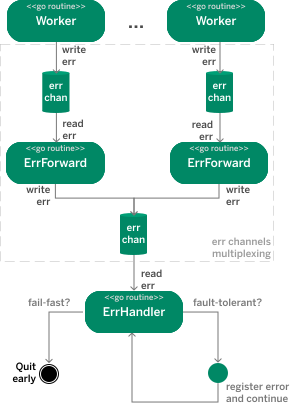

# Concurrency Pattern in Docforge

Docforge builds documentation bundles using multiple concurrent workers executing chunks of work in parallel, orchestrated in jobs by dedicated controllers. 

Each controller is associated with a dedicated work task queue, where it enqueues tasks. The tasks are picked up and processed by the controller workers as soon as a task and a free worker are available. A controller can be configured to wait for task to process until shutdown explicitly, or exit as soon as there are no tasks available. This behavior can changed dynamically at runtime, i.e. a controller can be started waiting for tasks and at a point in time it can be switched to process any tasks available in its queue and then exit when done.

<caption>Figure 1: Controller framework</caption>

There are three types of work to be performed, respectively three types of controllers and corresponding workers:
- Processing of documentation structure documents, performed by Documents Controller
- Download of referenced resources, performed by Downloads Controller
- Optionally, download of Git info for documentation structure documents, performed by GitInfo Controller

The diagram on Figure 2 illustrates the concurrency pattern in which the controllers are involved and key events.

<caption>Figure 2: Controllers and concurrency patterns</caption>

When a documentation structure is resolved from a manifest, the three controllers are started. The *Documents Controller* enqueues the structure nodes for processing in its queue altogether, because they are all known at that point in time. Note that the *Documents Controller* is started in a mode that instructs it to exit as soon as its tasks are finished. Unlike that, the other controllers are started in a mode waiting for tasks, until explicitly shutdown, because it is not known upfront when and what amount of they will need to process. Therefore they start operating as services. 

At some point, the *Documents Controller* may start enqueuing tasks to the other controllers and they will process them accordingly. At that point the other controllers operation is on demand. They may be busy processing tasks or continue waiting for tasks to arrive. Unlike the *Document Controller* operation mode, this is not a continuous uninterrupted work-on-tasks process. Intermediate wait times are until tasks are received are normal. 

Finally, the Documents Controller finishes its job. The conditions now change, because the other controllers cannot expect further tasks. Their operational mode is switched to "exit when finished with the tasks you already have".

The build finishes when all controllers have exited.

The described concurrency pattern is designed for maximum efficiency. The controllers step in as soon as there's work for them and step out immediately after their job is done with no delays or redundant processing. Other variants, such as staged processing, i.e. each controller takes over after the other, have their advantage in the simpler implementation, but efficiency was favored and they were ruled out. 

## Worker errors multiplexing

Parallel workers may raise errors and it depends on the workers controller job configuration how to proceed when they occur. The options are:
- **fault-tolerance**, which results in the error being registered and returned along with all other potential errors at the end of the process, thereby not stopping the controller from further execution of its job. 
- **fail-fast**, which results in halting the controller job immediately on first error, and returning that error

To support the *fault-tolerant* behavior along with the *fail-fast* one, each worker creates its own error channel and sends its errors to it (Figure 3). Since there are multiple error channels, one for each worker, they need to be multiplexed and the errors to be collected in a single channel monitored by a dedicated, parallel go routine. 

The role to actively forward errors to a common multiplexing channel is performed by **ErrForward**. These are go routines dedicated to worker error channel (one for each). When an error is received on the *multiplex* error channel, the **ErrHandler** go routine consults with the controller's job configuration. If it is configured for *fail-fast* operation, the routine stops the process immediately and reports the error. If it has to be *fault-tolerant*, it will record the error and continue and at the end of the process it will report a cumulative error.

<caption>Figure 3: Error channels multiplexing and error handling</caption>

In docforge the role of the **ErrHandler** is performed by the same routine that orchestrates the whole execution process. As soon as it spawns the workers it starts listening on channels for lifecycle events, among which are the execution errors received on the multiplexed error channel. This routine controls the job lifecycle and has access to the job configuration and is in the position to react accordingly on a worker error event.
The same routine is also responsible to start the **ErrForward** routines immediately after workers are spawned and initiate the multiplexing mechanism.
